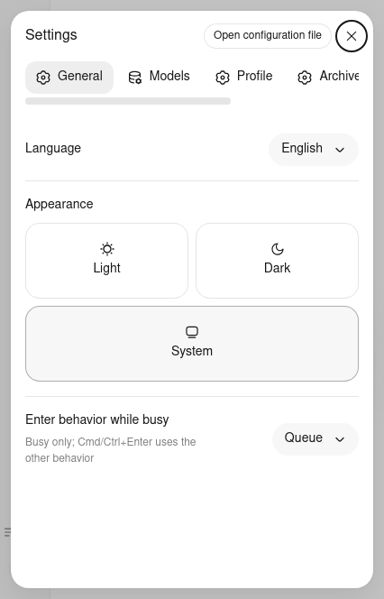

# 页面优先级修复验收（2026-10-03）

## 范围与产物

基于 `d705aa6` 的独立分支 `fix/ui-page-priority-20261003`。只修改自有 TS 前端，不改 Host、模型请求、Profile 格式、桌面安装包或正在运行的 3082 服务；不覆盖整轮折叠和工具参数的其他修复分支。提交后发现 #195 已合入 `master`（`6010a59`），将其合并到本修复分支；仅三个生成元数据文件冲突，保留双方源码并重建产物，而非选择某一侧的旧 dist。

- 生产整图：53 个模块、154 个资产，全部从仓库源码构建。
- `ui/dist/asset-manifest.json` SHA-256：`e03973f42896e7a94642ebc61c6d7adee2ee8b15eae97b2c84393784c36df46c`。
- `DialogSurface.tsx` SHA-256：`2239055c5be8a496de10384f954e04001e8a2100594fcc2e032d70ff657cd540`。
- 页面优先级回归脚本 SHA-256：`1515eb073b3bbebc4b53d952e0287ce5ee77ec8f4a0220e7cad158e71cf0bc3e`。

## 四项问题与修复

| 问题 | 修复 | 验证 |
| --- | --- | --- |
| 菜单 Esc 同时关闭设置 | 菜单消费 Esc；原生 dialog cancel 只关闭顶层，并阻止 React Portal 祖先冒泡 | 菜单先关闭、设置保留；嵌套 Modal 只关闭内层 |
| 设置 Tab 跳到背景 | 原生顶层令背景 inert，补齐正反向 Tab 边界循环，关闭后恢复打开按钮焦点 | 连续 Tab／Shift+Tab、焦点恢复与重复开关 |
| 窄屏表单与聊天框被挤压 | 设置导航移到顶部横向滚动；侧栏展开为覆盖抽屉，仍只预留 56px 控制轨 | 426×664 表单可用；输入框展开前后宽度不变；遮罩可点击关闭 |
| 折叠的设置图标无名称 | 隐藏但不从可访问树移除本地化标签 | 控制轨中的 Settings 可按名称定位并打开 |

## 浏览器矩阵

在 WZU_Server 使用隔离测试依赖 Playwright **1.61.1**（与当前 CI 一致）、Node **20.20.2**。Chromium revision 1228，WebKit revision 2311。实际源码和产物 Hash 与本机一致。首次完整矩阵日志对应合并 #195 前的产物 `40075f0…`；顶部 Hash 是最终合并后产物，后续集成矩阵另行保存。

以下入口 Chromium／WebKit 均通过：

1. `test-page-priority-browser.mjs`：真实整图 + fixture transport；嵌套确认另外使用实际平台 Modal/Menu 导出，避免伪造可删除提供方。
2. `test-owned-ui-boot-browser.mjs`：53 个插件加载、模型选择与设置；无页面异常、无静态资产失败。
3. `test-settings-save-feedback-browser.mjs`：保存失败提示处于模态层，保留输入焦点及中英文提示。
4. `test-plugin-center-browser.mjs`：侧栏导航、插件中心与返回聊天。
5. `test-browser-dock-native-browser.mjs`：真实平台／Runtime 的原生窗体桥接模拟回归；不是桌面安装验收。
6. `test-platform-source-browser.mjs`：冻结主分支与源码数学、Shiki、ABI、SlotCore；每个引擎 12 组布局／像素结果完全一致。仅排除新增原生模态运输层的 DOM wrapper，卡片及其他节点仍完整比较，两侧统一焦点状态，未修改冻结基线。

完整输出：[浏览器](page-priority/browser.log)、[平台差分](page-priority/platform.log)。WebKit fixture 中 HMR `/plugins/events` 的可选连接取消已单列；静态资产失败仍为零，不作为生产网络结论。

修复提交 `1e1ff4a` 在 WZU_Server 独立 Node **22.14.0** 完整复跑通过：owned type policy **23/23**、基础模块 **123/123**、布局 **3/3**，共 **149/149**，严格类型检查通过；[完整输出](page-priority/node22.log)。未改全局 Node 或注入 Polyfill。最终产物 `npm run check:build --prefix ui` 通过。所有 Rust 编译禁令保持不变，本次没有执行 Rust 编译。

## 合入最新 main 后的复验

保留 #195 的源码并重建后，确定性构建再次通过。独立 Node 22.14.0 + Playwright 1.61.1 下，两引擎再次通过页面优先级和真实整图启动，并验证 #195 的两条主链路：

- 更新器 14 项 Node 测试及滚动跟随 helper 回归通过。
- Chromium／WebKit 各 24 个真实 sticky composer／updater／shell 层级场景通过；未调用安装或重启。
- 两引擎实际 ChatView 滚轮、微小向上阅读、resize／append 竞态、键盘／触摸／滚动条、返回底部及 compact 回归通过。
- Rail 测试同时等待 frame 几何和实际 slot 里的 Open sidebar／唯一 New session 控件，避免异步 concession 尚未发布时抢点旧宽侧栏控件；未放松功能断言。

[完整合并后输出](page-priority/merged-main.log)包含最终产物和脚本 Hash，区别于首次矩阵日志。

## 边界

上述页面操作使用隔离 fixture，不调用真实 Host、不删用户数据、不提交真实模型请求。额外的 Node 20 基础模块复跑为 121/123：两个冻结 timer 用例缺少 `Promise.withResolvers`（当前 CI 要求 Node 22），不是本次 UI 的失败。保留 [诊断输出](page-priority/node20.log)，未给生产代码或测试注入 Polyfill。首次浏览器测试工具发现共享 Playwright 已升级但相应 WebKit 未安装，改为独立固定 1.61.1 后重新执行上述矩阵；初次验收脚本误假设 fixture 提供方可删除、以及 resize 尚未结算的时序问题也已纠正，未通过关闭断言绕过。

桌面原生 WebView、安装包和运行中服务仍需合并／部署后的独立验收，`UI-PRIORITY-RELEASE-01` 保持未完成。
