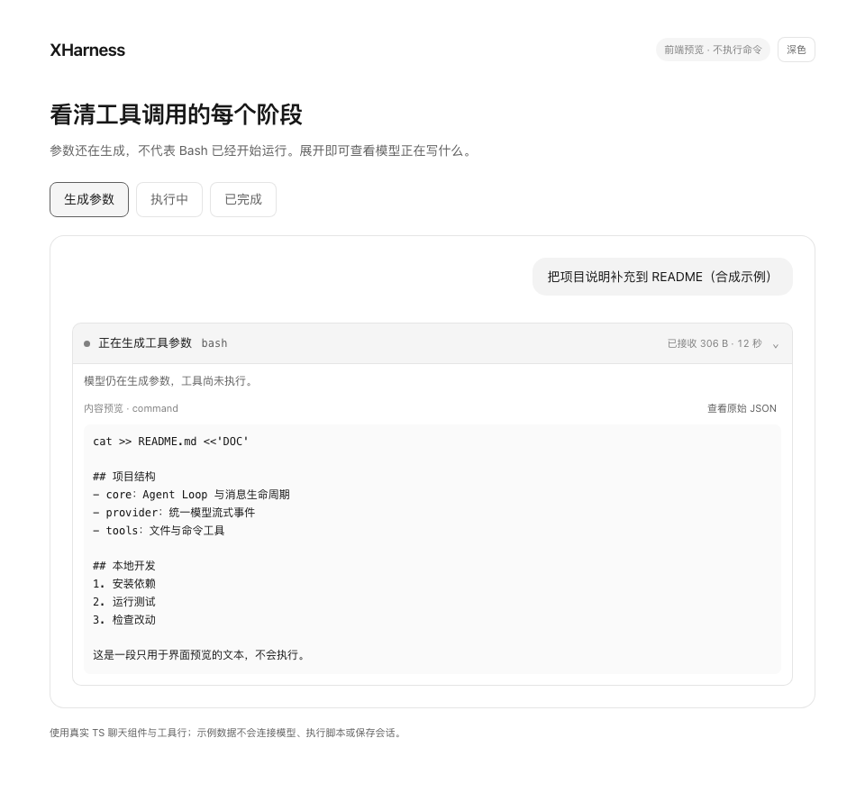
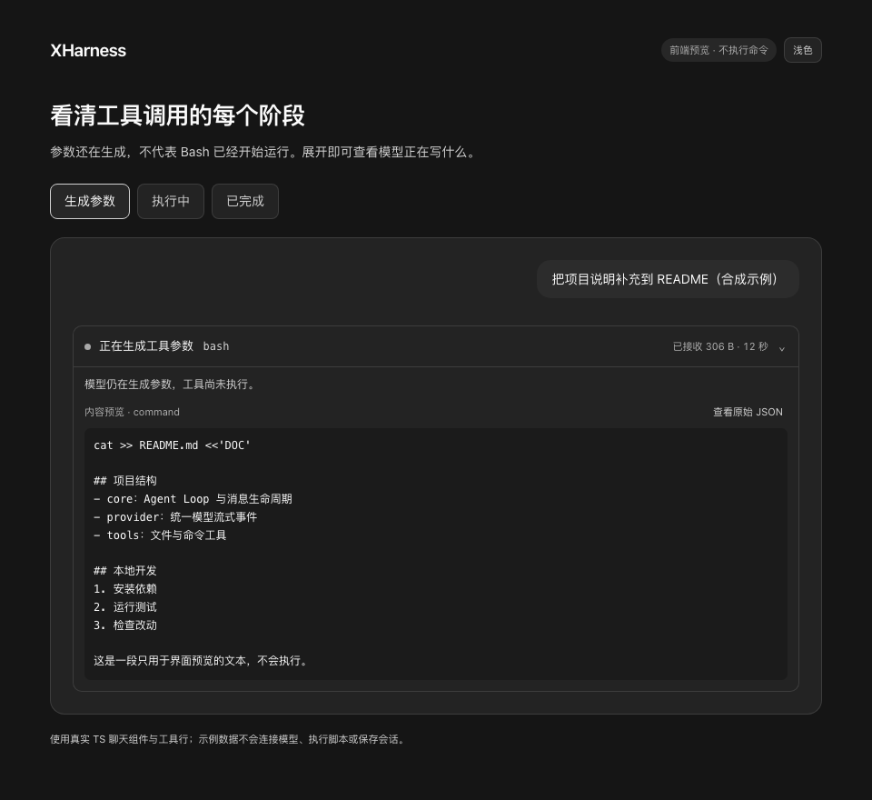

# 工具参数生成 UI 验收（2026-10-06）

## 范围

- 初始开发基线：`origin/master` 的 `a3d5c6d`；提交 PR 前已对齐最新 `bd14d18`，重新生成前端资源并复跑表内相关回归。
- 独立分支：`feat/tool-argument-progress-20261006`，未混入其他设置遮罩修改。
- 仅 TS／CSS 与前端测试、预览及文档；没有改 Rust、工具执行、模型请求或审批策略。
- 本机只执行 Node／TypeScript 命令，没有本机 Rust 编译；未更换已安装 XHarness 或停止 Host。

## 已通过

| 命令／场景 | 结果 |
| --- | --- |
| `npm run typecheck --prefix ui` | 通过 |
| `npm run build --prefix ui` | 严格 owned TS 及生成物通过，55 个模块／190 个资源 |
| `npm run check:build --prefix ui` | 字节级构建一致性通过 |
| `node --test scripts/test-tool-argument-progress.mjs` | 6 项通过 |
| `node scripts/test-assistant-projection.mjs` | 维护源码／冻结基线的文本、Unicode、工具、思考、终态与刷新均通过 |
| `node scripts/test-assistant-visibility-lifecycle.mjs` | 2,704 个帧分区、287 个历史分页切分及重复事件、重试、取消通过 |
| 新工具参数浏览器测试 | Chromium、WebKit 均通过 |
| `scripts/test-tool-source-browser.mjs` | Chromium、WebKit 的维护源码工具行、执行／结果、展开状态、失败与窄屏回归通过 |

新增浏览器覆盖：键盘展开、原文／解码切换、UTF-8 字节、HTML 纯文本、连续增量、窗口化状态保留、重试重置、预览上限、窄屏／暗色、减少动画、多个工具、空名称、小 JSON 交接、取消、英文词条及定时器释放。浏览器依赖为独立的 Playwright 1.61.1，不打开真实 Host 或用户会话。

## 可见证明

本地预览 `http://127.0.0.1:4186/` 已打开，人工检查了窄屏展开卡片；使用真实维护组件及合成 README 参数，无命令执行或模型调用。

### 配色一致性补验收

- 删除独立蓝色与预览调色板，真实加载产品 Theme 与 `monochrome.css`；浅／深色沿用相同的 Token ABI，增加仅影响预览的配色切换。
- 修复旧 Preparing 徽章样式覆盖新卡片的冲突；浏览器断言纵向布局和整卡不闪烁。
- Chromium、WebKit 重跑新 UI 回归：比较卡片、状态点、代码底色、聊天气泡与产品 Token 的实际计算颜色，检查中性灰度及浅／深色切换通过。
- 严格 TS、构建、构建一致性、原 `test-monochrome-theme.mjs` 与 `test-silver-surface.mjs` 均通过；人工刷新预览并检查暗色窄屏效果。

## 未完成的发布证明

- 变更提交用于 PR 审核；本次提交的 GitHub 全量 CI 仍为独立门禁，以 PR 当前提交的检查状态为准。
- 尚未把修改打入原生安装包，没有替换安装版、部署生产前端或验收所有 Provider 的真实流式链路。
- 此功能改善可观测性，不减少模型生成 Token 数；没有据此声称生成或工具执行速度提升。
