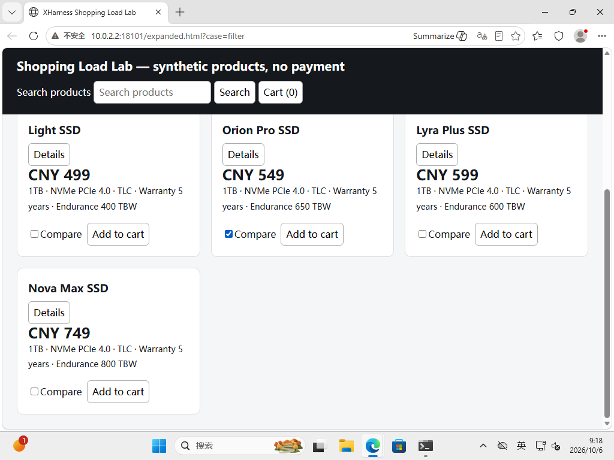

# 简短操作描述实验（2026-10-06）

## 修改范围

仅向 `xharness-computer::definition()` 的 8 个字段增加描述，涵盖 9 种动作。说明滚动符号与单位、键名、文字插入不自动清空、点击会触发动作、目标必须来自最新观察。未修改输入类型、默认值、权限、验证、调度、执行和原生适配器；不规定模型探索顺序。新增声明导出 example 与 schema 回归测试。

## 验证

- 本机只做格式化与 Python 测试；Rust 源码含未提交修改先同步到 WZU_Server。
- 远程 `cargo test --locked -p xharness-computer`：8 项通过。
- 远程 `cargo clippy --locked -p xharness-computer --all-targets -- -D warnings`：通过。
- 实验判定器 6 项测试通过；加强最终状态检查，避免用历史正确状态假通过。
- 44 张实际原生截图通过 receipt SHA256、大小、PNG 和尺寸校验。

## 真实模型结果

使用 DeepSeek Flash（temperature=0，thinking disabled），在独立 Windows 克隆的同一合成购物页面运行。调用实际注册 ComputerTool → ToolExecutor → Windows native adapter，不用 DOM 替模型操作。A 为运行二进制的原声明，B 为本次源码在远程编译导出的新声明；去掉所有 description 后两者完全一致。运行二进制仍是 16c5568，未替换用户软件。

| 任务 | 原描述 A | 新描述 B |
|---|---|---|
| 滚动定位、打开详情并返回 | 12 次工具调用后未完成；3 次工具拒绝 | 12 次工具调用后未完成；0 次工具拒绝 |
| TLC 筛选、升序排序、比较两个商品 | 12 次调用后未完成，最终排序仍错，未完成比较 | 12 次调用后筛选和升序正确；只勾选 Orion，未完成比较和最终报告 |

滚动组 B 仍将负数用于向下滚动（首次 -1200），随后拖动滚动条但错过目标。工具拒绝减少不能等同于任务质量提高，也不能据单样本认为稳定性改善。B 未使用键盘，因此不能宣称键名描述有效。

这里的 12 次响应上限是控制 A/B 成本的实验条件，不是新增产品限制。`no_controller_error=false` 的旧判定器字段由“达到实验上限”造成，不代表原生执行崩溃；results.json 单独标注 termination_class。任务完成必须由实际页面事件与正确最终报告共同确认，不能以安装成功、模型自评或工具返回成功替代。

商品判定器在收集后收紧：必须检查最后的页面快照与最后的比较事件，而不是任何历史成功事件。该规则同样应用于所有可用 A/B 样本；模型提示、页面和运行时未改。

## 成本与边界

48 个真实模型响应累计提供方报告输入 3,889,856 tokens（其中缓存命中 3,256,320、未命中 633,536），输出 6,917 tokens。实际人民币扣费未获取，不报猜测价格。输入量是各次重复上下文的累计量，不是单次上下文。默认观察及后续消息很大：单次输入最高 212,387 tokens，这并非新增描述本身造成。首次滚动请求 A=1,076，B=1,354，新增描述实测 +278 tokens。

样本很少且任务未完成，不能证明描述提升总体成功率。新描述已进入源码，尚未发布或替换软件。筛选任务 A/B 各仅一次，B 在新探针中补跑；观察到部分步骤改善不证明因果或整体可靠性。该实验也不是完整 Host、真实购物站点或 Mac 行为验收。

## 清理与证据

第一探针 50 个操作后正常退出，probe_alive=false。控制接口恢复后，第二探针 17 个操作后正常退出，probe_alive=false；三个自有采集服务均停止并验证退出。恢复时创建的本机隧道已停止，临时控制台标签已关闭。原虚拟机、用户应用和 3271 Web 不改动、不重启。

`results.json` 为逐项结果，`cost-ledger.json` 为提供方用量，`description-only-contract.json` 为只改描述的校验。`primary/` 保存原始请求、回执、截图、事件及模型输出（大 JSON 使用 gzip）；`filter-fresh-probe/` 保存补跑的 B 组实测证据。SHA256SUMS 覆盖所有证据文件。

## 补测观察

B 组 277.67 秒、12 次工具调用：TLC 与升序最终状态正确，只选择 Orion 比较框，没有选择 Lyra 或点击比较按钮；无最终报告。一项 stale_frame 拒绝后模型重新 observe。多次负方向滚动无效，后用 End 看到了 Nova，但探索耗尽相同实验上限。没有虚构“任务已完成”，也没有加入购物车。

外层 shell 包装使用 zsh 只读变量 status 导致退出后报错，发生在 Python suite 已完成并收到 probe_alive=false 之后，不是实验工具或模型失败。

最终页面截图：

